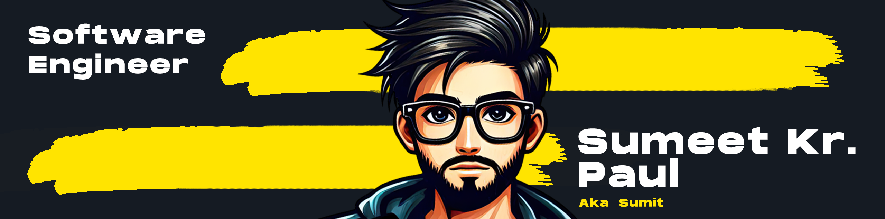

## &nbsp;Hi there ! <a href="https://www.gautamkrishnar.com/"></a>
This is the place where I practice stuff and break things :joy:

- 🌱 &nbsp;I’m currently focusing on ```Production-Grade Frontend Systems```
- 👨‍💻 &nbsp;Read more about my projects at [GitHub](https://github.com/sumittttpaul?tab=repositories) and [LinkedIn](https://www.linkedin.com/in/sumitttpaul/details/featured/)
- 💬 &nbsp;Ask me about anything related to: ```React & Next.js frontend architecture```, ```State transitions and lifecycle correctness```, ```Async UI and race-condition handling```, ```Performance optimization and memoization```, and ```Repo-based debugging and safe incremental fixes```

## 🔗 &nbsp;**Connect with me**
Connect with me through ```LinkedIn``` and ```Email```

&nbsp;&nbsp;&nbsp;<a href="https://linkedin.com/in/sumitttpaul" target="blank"></a>&nbsp;&nbsp;&nbsp;&nbsp;
<a href="mailto:sumitpaul.work@gmail.com" target="blank"></a>&nbsp;&nbsp;&nbsp;&nbsp;

## ✨ &nbsp;About me
Frontend Engineer focused on building production-grade React and Next.js applications with predictable UI behavior, safe state transitions, and lifecycle correctness.

I work primarily on real-world frontend problems — debugging existing codebases, fixing edge-case failures, and improving UI reliability under stress conditions such as rapid user interactions, navigation changes, and async race scenarios.

My day-to-day engineering focus includes:
- Correct state updates during fast interactions and re-renders
- Preventing stale UI caused by overlapping API requests
- Cleanup-safe effects (event listeners, timers, async logic)
- Click-outside handling and complex UI interaction rules
- Rendering performance via memoization and stable callbacks

I optimize for correctness and risk reduction, not clever abstractions — preferring minimal, safe fixes that stabilize production behavior.

## 🚀 Projects
All of my projects are released as open-source on GitHub, this includes some of my favourite projects:
#### ● &nbsp;[SumitApp](https://sumit-app.vercel.app)
&nbsp;&nbsp;&nbsp;&nbsp;A pre-configured boilerplate for fast, scalable monorepo development. Packed with shared configs and tooling to kickstart your next project.

[](https://github.com/sumittttpaul/SumitApp)

#### ● &nbsp;[Emotion Outfit](https://emotionoutfit.vercel.app)
&nbsp;&nbsp;&nbsp;&nbsp;An e-commerce store where people can shop for apparel to enhance their attire and look good. This project features a unique and intriguing login flow inspired by the Windows setup.

[](https://github.com/sumittttpaul/Emotion-Outfit)

.&nbsp;.&nbsp;.&nbsp;[and more](https://github.com/sumittttpaul?tab=repositories) 

I create most of my open-source projects to solve the challenges I encounter in life, with many more still waiting to be addressed. I am embarking on a quest to find solutions for each one, one problem at a time.
```
  ____                  ____                      
 / __ \___  ___ ___    / __/__  __ _____________  
/ /_/ / _ \/ -_) _ \  _\ \/ _ \/ // / __/ __/ -_) 
\____/ .__/\__/_//_/ /___/\___/\_,_/_/  \__/\__/  
   _/_/                  __  __   _               
  / __/  _____ ______ __/ /_/ /  (_)__  ___ _     
 / _/| |/ / -_) __/ // / __/ _ \/ / _ \/ _ `/ _ _ 
/___/|___/\__/_/  \_, /\__/_//_/_/_//_/\_, (_|_|_)
                 /___/                /___/       
```
In the pinned projects section, you will find some of my open-source projects that I've built in my free time for practicing the software engineering over the past five years. I've continuously learned the latest technologies and created projects for some startups, brands and individuals, for which I received payment. 

Eventually, I transitioned into software engineer, developing numerous web & native apps across various genres, including ```e-commerce```, ```landing pages```, ```portfolios```, ```booking systems```, ```online marketing```, ```SaaS```, and more.

You can read more about me and my journey at my LinkedIn profile: [sumitttpaul](https://www.linkedin.com/in/sumitttpaul/)

## 📣 How about an inspirational quote before you go?
> **The only way to do great work is to love what you do.**
>
> _<p>- by Steve Jobs</p>_

Absolutely! Steve Jobs has been a significant source of inspiration for me.

## 🎸 Music track
Another fun fact: I ❤️ listening to music, and here's the last song I listened to:


<p align="center">
  
</p>
